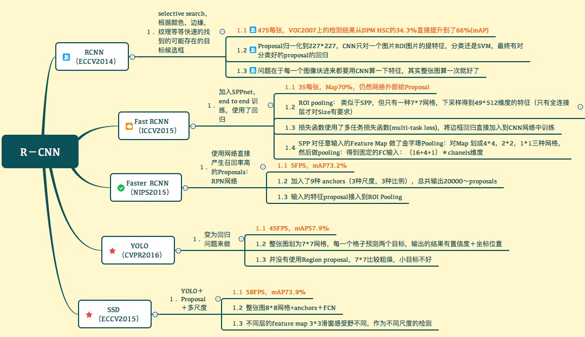

# CNN

 深度 \| 从入门到精通：卷积神经网络初学者指南（附论文）

[link](https://mp.weixin.qq.com/s?__biz=MzA3MzI4MjgzMw==&mid=2650717691&idx=2&sn=3f0b66aa9706aae1a30b01309aa0214c&scene=0#wechat_redirect)

cnn-benchmarks: [https://github.com/jcjohnson/cnn-benchmarks](https://github.com/jcjohnson/cnn-benchmarks)

**CNN** 工作概述指的是你挑一张图像，让它历经一系列卷积层、非线性层、池化（下采样（downsampling））层和完全连接层，最终得到输出。

**典型的 CNN 结构**：输入→卷积→ReLU→卷积→ReLU→池化→ReLU→卷积→ReLU→池化→全连接

LeNet5，1998；AlexNet-8，2012；VGGNet-19，2014；InceptionNet-22但参数量小，2014；ResNet-152-3.46%，2015

卷积的操作，主要进行2种变换，\(1\)spatial dimensions，空间变换; \(2\)channel dimension，通道变换

**激活层**：在每个卷积层之后，通常会立即应用一个非线性层（或激活层）。其目的是给一个在卷积层中刚经过线性计算操作（只是数组元素依次（element wise）相乘与求和）的系统引入非线性特征。

**池化层**：这个层主要使用不同的函数为输入降维。通常，最大池化层（max-pooling layer）出现在卷积层之后。池化层使用 2\*2 的矩阵，以卷积层相同的方式处理图像，不过它是给图像本身降维。下面分别是使用「最大池化」和「平均池化」的示例。基本上采用一个过滤器（通常是 2x2 的）和一个同样长度的步幅。

这到达了**两个主要目的**。第一个是权重**参数的数目减少**到了75%，因此降低了计算成本。第二是它可以**控制过拟合**（overfitting）。

图像分类中max-pooling和average-pooling之间的异同

[https://blog.csdn.net/u012193416/article/details/79432668](https://blog.csdn.net/u012193416/article/details/79432668)

根据相关理论，特征提取的误差主要来自两个方面：

（1）邻域大小受限造成的估计值方差增大；

（2）卷积层参数误差造成估计均值的偏移。

一般来说，mean-pooling能减小第一种误差，更多的保留图像的背景信息，max-pooling能减小第二种误差，更多的保留纹理信息。

**反向传播**可分为四部分，分别是前向传导、损失函数、后向传导，以及权重更新

步幅：过滤器移动的距离

填充：在网络的早期层中，我们想要尽可能多地保留原始输入内容的信息，这样我们就能提取出那些低层的特征。比如说我们想要应用同样的卷积层，但又想让输出量维持为 32 x 32 x 3 。为做到这点，我们可以对这个层应用大小为 2 的零填充（zero padding）。

**Dropout 层**

Dropout 层将该层中一个随机的激活参数集，即在前向通过（forward pass）中将这些激活参数集设置为 0。

该网络将能够为样本提供合适的分类或输出，即使一些激活参数被丢弃。此机制将保证神经网络不会对训练样本「过于匹配」，帮助缓解过拟合问题。

**1 x 1卷积**

1x1 的卷积层**跨越了特定深度**，所以我们可以设想一个1 x 1 x N 的卷积层，此处 N 代表该层应用的过滤器数量。

1\*1 的卷积是一个非常优秀的结构，它可以跨通道组织信息，提高网络的表达能力，同时可以对输出通道升维和降维。

感受野 [link](https://zhuanlan.zhihu.com/p/98656751)

卷积神经网络CNN中，决定某一层输出结果中一个元素所对应的输入层的区域大小，被称作感受野receptive field。

数据增强：灰度变化、水平翻转、垂直翻转、随机编组、色值跳变、翻译、旋转等。

计算任意给定卷积层的输出的大小的公式是

其中 O 是输出尺寸，K 是过滤器尺寸，P 是填充，S 是步幅。

**CNN网络架构演进**

CNN 浅析和历年 ImageNet 冠军模型解析

[https://www.infoq.cn/article/cnn-and-imagenet-champion-model-analysis/](https://www.infoq.cn/article/cnn-and-imagenet-champion-model-analysis/)

CNN网络架构演进：从LeNet到DenseNet

[https://www.cnblogs.com/skyfsm/p/8451834.html](https://www.cnblogs.com/skyfsm/p/8451834.html)

ResNet:一个模块的输入和输出关系看作是y=H\(x\)，那么直接通过梯度方法求H\(x\)就会遇到退化问题，使用这种带shortcut的结构，那么可变参数部分的优化目标就不再是H\(x\),若用F\(x\)来代表需要优化的部分的话，则H\(x\)=F\(x\)+x，也就是F\(x\)=H\(x\)-x。

DenseNet 是一种具有密集连接的卷积神经网络。在该网络中，任何两层之间都有直接的连接，也就是说，网络每一层的输入都是前面所有层输出的并集，而该层所学习的特征图也会被直接传给其后面所有层作为输入。

**ResNet** 18 的结构解读\(17conv+fc\)

[https://blog.csdn.net/wchzh2015/article/details/93883771](https://blog.csdn.net/wchzh2015/article/details/93883771)

y=F\(x\)+x; y=F\(x\)+Wx当channel数目不同时

**Inception** v1,v2,v3,v4

[https://blog.csdn.net/qq\_14845119/article/details/73648100](https://blog.csdn.net/qq_14845119/article/details/73648100)

V1: Inceptionmodule

V2: Batch Norm, 并且使用2个3\*3替代1个5\*5卷积

V3: 主要在v2的基础上，提出了卷积分解（Factorization）

将7\*7分解成两个一维的卷积（1\*7,7\*1），3\*3也是一样（1\*3,3\*1），这样的好处，既可以加速计算（多余的计算能力可以用来加深网络），又可以将1个conv拆成2个conv，使得网络深度进一步增加，增加了网络的非线性，更加精细设计了35\*35/17\*17/8\*8的模块。

V4: 利用残差连接来改进v3结构, Inception-ResNet

Xception: 在Inception V3的基础上提出了\(Extreme Inception\)，通道分离式卷积（depthwise separable conv\)，分解一个标准的卷积为一个depthwise conv和一个pointwise conv。

**MobileNet**

是Exception思想的应用, 区别就是Exception文章重点在提高精度，而MobileNets重点在压缩模型，同时保证精度。

**ShuffleNet**

mobileNet只做了3\*3卷积的deepwise conv，而1\*1的卷积还是传统的卷积方式，还存在大量冗余，ShuffleNet则在此基础上，将1\*1卷积做了shuffle和group操作，实现了channel shuffle 和pointwise group con操作，最终使得速度和精度都比mobileNet有提升。

\(a\)是原始的mobileNet的框架，各个group之间相互没有信息的交流。\(b\)将feature map做了shuffle操作

**目标检测**

 目标检测算法综述：R-CNN，faster R-CNN，yolo，SSD，yoloV2

[https://www.imooc.com/article/37757](https://www.imooc.com/article/37757)

目标检测算法总结

[https://www.cnblogs.com/guoyaohua/p/8994246.html](https://www.cnblogs.com/guoyaohua/p/8994246.html)

**RCNN**

* 1. SS: 评估相邻图像之间的相似度，把相似度高的进行合并，并对合并后的区块打分，选出大概2000个候选框;
  2. 像裁剪缩放到相同尺寸; 分别对子图使用卷积神经网络
  3. SVM分类

**Fast RCNN**

Single Conv Feature Extraction; ROI Pooling; multi-task loss; softmax

最重要的一点就是包含特征提取器、分类器和边界框回归器在内的整个网络能通过多任务损失函数进行端到端的训练，这种多任务损**失即结合了分类损失和定位损失的方法，大大提升了模型准确度。**

**ROI Pooling**

如果目标输出为MxN，则在水平和竖直方向上，将输入proposal划分为MxN份，每一份取最大值，从而得到MxN的输出特征图。

**Faster RCNN**

RPN

四层：Conv\(resNet101\), RPN, ROI Polling, Classification+Bounding Box Regression

**RPN**

**9 个锚点框**：3 个不同宽高比{1:1, 1:2, 2:1}的 3 个不同大小{128, 256, 512}的锚点框，每一个位置使用 9 个锚点，每个位置会生成 2×9 个 objectness 分数和 4×9 个坐标。

目标检测中的Anchor

[https://zhuanlan.zhihu.com/p/55824651](https://zhuanlan.zhihu.com/p/55824651)

RCNN 解决的是，“为什么不用CNN做特征提取呢？”

Fast-RCNN 解决的是，“为什么不直接在feature map上做region proposal？”, 但selective search generate regional proposal的时间实在太长了

Faster-RCNN 解决的是，“为什么不用CNN做region proposal呢？”

**YOLO**

卷积层\(inceptionV1\)，目标检测层\(4conv+2fc\)，NMS筛选层

将一副448x448的原图分割成了**7x7个网格**，每个网格要预测**两个bounding box**的坐标\(x,y,w,h\)和box内包含物体的置信度**confidence**，以及物体属于**20**类别中每一类的概率, 所以参数为（4x2+2+20\) = 30

yolo的**损失函数**包含三部分，位置误差，confidence误差，分类误差。\(都采用了均方差\)

**缺点**:

* 1. 每个网格只对应两个bounding box，长宽泛化能力不强；原始图片只划分为7x7的网格
  2. 当两个物体靠的很近时，效果很差
  3. 最终每个网格只对应一个类别，容易出现漏检（物体没有被识别到）

YoloV2:

网络采用DarkNet-19; 去掉全连接层; batch norm; anchors

YoloV3

Darknet -53\(残差\)；多尺度检测；对象分类用Logistic取代了softmax\(分类损失采用binary cross-entropy loss\)

从YOLOv1到v3的进化之路

[http://www.mamicode.com/info-detail-2314392.html](http://www.mamicode.com/info-detail-2314392.html)

**SSD**

[https://zhuanlan.zhihu.com/p/24954433?refer=xiaoleimlnote](https://zhuanlan.zhihu.com/p/24954433?refer=xiaoleimlnote)

和yolo一样，也分为三部分：卷积层\(VGG16\)，目标检测层\(5个卷积层和一个average pooling组成，去掉了最后的全连接层\)，NMS筛选层

每一个卷积层，都会输出不同大小感受野的feature map。在这些不同尺度的feature map上，进行目标位置和类别的训练和预测，从而达到多尺度检测的目的，可以克服yolo对于宽高比不常见的物体，识别准确率较低的问题。而yolo中，只在最后一个卷积层上做目标位置和类别的训练和预测。这是SSD相对于yolo能提高准确率的一个关键所在。

![Machine generated alternative text:
10&#xD7;10&#xD7;512
3mx300x3
VGG
up
conv43
InputImage
\#def.boxes:
19x19x1024
VGG
upto
\#def.boxes&#xFF1A;6
Detector
21
&#xFF08;19&#xB7;19&#x5659;6&#xFF09;classifier2
5x5&#xD7;256
3x3&#xD7;256
1x1x256
Conv
layers
layers
Conv
layers
\#def.boxes&#x2022;
pooling
\#def.boxes&#x2022;\(
\#detections
perclass.
339&#xFF0E;4
=5776
Normalization
Detector
classifier1
\#def.boxes:6
Detector
&#xFF08;1&#x4FE8;1&#x4F0A;6
classifier3
\#def.boxes:6
Detector
1
&#xFF08;5&#xB7;5&#xB7;6
classifier4
3&#xB7;4=
26
Detector
classifier5
0b4
Detector
classifier6
\#detectionsper
ClaSSoveral&#x4E0A;
5776+21+150+364=
8&#xFF0C;732
FastNon-MaximumSuppression&#xFF08;FastNMS\)
Finaldetections](../.gitbook/assets/15%20%283%29.png)

在每个卷积层上都会进行目标检测和分类，最后由NMS进行筛选，输出最终的结果。多尺度feature map上做目标检测，就相当于多了很多宽高比例的bounding box，可以大大提高泛化能力。

6个anchor，每个anchor，每个anchor对应4个位置参数\(x,y,w,h\)和21个类别概率（voc训练集为20分类问题，在加上anchor是否为背景，共21分类）

**基础知识：IoU、NMS、Bounding box regression**

[https://zhuanlan.zhihu.com/p/60794316](https://zhuanlan.zhihu.com/p/60794316)

**IoU**

非极大值抑制（Non-Maximum Suppression，**NMS**）

* 1. 分类器会给每个bounding box（bb）计算出一个class score，就是这个bb属于每一类的概率，NMS就是根据这些值来进行的，主要流程：
     * 对于每一类，首先把所有score&lt;thresh的bb的score设为0
     * 之后，将所有的bb按照得分排序，选中最高分及其对应的bb
     * 遍历其余的bb，如果和当前最高分bb的重叠面积\(IoU\)大于一定的阀值，便将该bb删除
     * 从未处理的bb中继续选择一个最高分的bb，重复上述过程
     * 重复上述过程，直到找到全部保留的bb, 根据所有保留bb的class score和class color画出最后的预测结果

从ROI Pooling到ROI Align

[https://www.jianshu.com/p/2a5ffca8b861](https://www.jianshu.com/p/2a5ffca8b861)

数字图像处理中常用的插值方法: 最邻近元法; 双线性内插法; 三次内插法

**评价指标mAP**

 平均精度均值\(mAP\)——目标检测模型性能统计量

[https://www.cnblogs.com/guoyaohua/p/9901614.html](https://www.cnblogs.com/guoyaohua/p/9901614.html)

什么是MAP？ 理解目标检测模型中的性能评估

[https://cloud.tencent.com/developer/article/1096162](https://cloud.tencent.com/developer/article/1096162)

mAP即数据集中所有类别的平均精度的均值。

* 1. 给定的图片中类别 C 的精确率=图片中类别 C 的真正类数量/图片中类别 C 所有目标的数量
  2. 类别 C 的平均精度=验证集中该类 C 的所有精确率的和/含有该类别 C 目标的图像数量

**目标检测算法的损失函数**

[link](https://xudonghecs.github.io/2019/02/20/%E7%9B%AE%E6%A0%87%E6%A3%80%E6%B5%8B%E7%AE%97%E6%B3%95%E7%9A%84%E6%8D%9F%E5%A4%B1%E5%87%BD%E6%95%B0/)

目标检测的主要功能是定位和识别，损失函数的功能主要就是让定位更精确，识别准确率更高。

其中常见的定位损失函数如MSE和Smooth L1,分类损失如交叉熵、softmax loss、logloss、focal loss等。

目标分割是像素级的分割即每个点是什么都需要做一个识别的置信度评估，通常于分类相类似。

SSD算法--损失函数的详解

[https://blog.csdn.net/Tomxiaodai/article/details/82354720](https://blog.csdn.net/Tomxiaodai/article/details/82354720)

**Smooth l1**

L1 对 x 的导数为常数。这就导致**训练后期**，预测值与 ground truth 差异很小时， L1 损失对预测值的导数的绝对值仍然为 1，而 **learning rate** 如果不变，损失函数将在稳定值附近波动，难以继续收敛以达到更高精度。

* 1. 当预测框与 ground truth 差别过大时，梯度值不至于过大；
  2. 当预测框与 ground truth 差别很小时，梯度值足够小

**YoloV1**

位置误差，confidence误差，分类误差，误差均采用了均方差

**目标检测样本不均衡**

[https://zhuanlan.zhihu.com/p/60698060](https://zhuanlan.zhihu.com/p/60698060)

 目标检测小tricks--样本不均衡处理

[https://zhuanlan.zhihu.com/p/60612064](https://zhuanlan.zhihu.com/p/60612064)

主要体现在两方面：**正负样本不均衡**和**难易样本不均衡**

**正样本**：标签区域内的图像区域，即目标图像块; **负样本**：标签区域以外的图像区域，即图像背景区域

解决方案：**OHEM**\(在线困难样本挖掘\)、**S-OHEM**\(基于loss分布采样的在线困难样本挖掘\)、**A-Fast-RCNN**（基于对抗生成网络的方式来生成困难样本）、**Focal Loss**\(损失函数的权重调整\)、**GHM**（损失函数梯度均衡化机制-动态损失函数）

PS: 一般在目标检测任务框架中，保持正负样本的比例为1:3（经验值）

**Focal Loss**

Focal Loss，如何更好地理解？

[https://zhuanlan.zhihu.com/p/32423092](https://zhuanlan.zhihu.com/p/32423092)

5分钟理解Focal Loss与GHM

[https://zhuanlan.zhihu.com/p/80594704](https://zhuanlan.zhihu.com/p/80594704)

Focal Loss 就是一个解决分类问题中类别不平衡、分类难度差异的一个 loss

![&#x5636; &#x79F0; &#x4E3A; &#x5E73; &#x8861; &#x56E0; &#x5B50; &#xFF0C; &#x7532; &#x6765; &#x5E73; &#x8861; &#x6B63; &#x8D1F; &#x6837; &#x672C; &#x672C; &#x8EAB; &#x7684; &#x6BD4; &#x4F8B; &#x4E0D; &#x5747; &#xFF0C; &#x5176; &#x503C; &#x51CF; &#x5C0F; &#x65F6; &#x6B63; &#x6837; &#x672C; &#x7684; &#x6743; &#x91CD; &#x5927; &#xFF0C; 
&#xFF08; 1 &#x4E00; \(t\)7 &#x7532; &#x4E8E; &#x5E73; &#x8861; &#x96BE; &#x6613; &#x6837; &#x672C; &#x7684; &#x6BD4; &#x4F8B; &#x4E0D; &#x5747; &#xFF0C; 7 &amp;gt; 0 &#x51CF; &#x5C11; &#x6613; &#x5206; &#x6837; &#x672C; &#x7684; &#x635F; &#x5931; &#xFF0C; &#x4F7F; &#x6A21; &#x578B; &#x53F2; &#x5173; &#x8FD8; &#x4E8E; &#x56F0; &#x9032; 
&#x7684; &#xFF0E; &#x5206; &#x7684; &#x6837; &#x672C; &#xB7; &#x4F8B; &#x5982; 7 &#xFF1A; 2 &#xFF0C; &#x578B; &#x5BF9; &#x4E8E; &#x5DE2; &#x6B63; &#x6837; &#x672C; &#x9884; &#x6D4B; &#x7F6E; &#x4FE1; &#x4E3A; &#x4F4F; 9 &#xFF0C; 0 &#x4E00; 0 &#xFF0E; 9 &#xFF09; 7 = 0 &#xFF0E; 01 &#x8FD9; &#x65F6; ](../.gitbook/assets/20%20%282%29.png)

γ=2,α=0.25效果最好

The 9 Deep Learning Papers You Need To Know About \(Understanding CNNs Part 3\)

[https://adeshpande3.github.io/The-9-Deep-Learning-Papers-You-Need-To-Know-About.html](https://adeshpande3.github.io/The-9-Deep-Learning-Papers-You-Need-To-Know-About.html)

Andrej Karpathy - Convolutional Neural Networks

[https://cs231n.github.io/convolutional-networks/](https://cs231n.github.io/convolutional-networks/)

Understanding Neural Networks Through Deep Visualization

[http://yosinski.com/deepvis](http://yosinski.com/deepvis)

![Machine generated alternative text:
RBM/DBN
&#x52A0;&#x5165;CNN&#x5377;&#x79EF;&#x5C42;
&#x8FDB;&#x884C;&#x7247;&#x8F6C;&#x6362;
DCGAN
&#xFF08;2015&#xFF09;
&#x63D0;&#x51FA;Cycle-ConsistencyLoss&#x89E3;&#x51B3;&#x56FE;&#x7247;&#x8F6C;&#x6362;&#x95EE;&#x9898;
GAN
&#xFF08;2014&#xFF09;
CycleGAN
&#xFF08;201&#x5200;
&#x6E10;&#x8FDB;&#x589E;&#x5927;&#x7684;&#x65B9;&#x5F0F;&#x8BAD;&#x7EC3;
&#x751F;&#x6210;&#x50CF;
&#x52A0;&#x5165;&#x5149;&#x6D41;&#x7EA6;&#x675F;&#x89E3;&#x51B3;&#x524D;&#x540E;&#x5E27;&#x4E0D;&#x4E00;&#x81F4;&#x95EE;&#x9898;
PGGAN
&#xFF08;2017&#xFF09;
AutOEncoder
i&#x5DDD;&#x7EC3;&#x55BC;&#x5B9A;GAN&#x6280;&#x5DE7;
ImprovedGAN
&#xFF08;2016&#xFF09;
&#x63D0;&#x51FA;PAC&#x5224;&#x522B;&#x5668;&#x89E3;&#x51B3;modelcollapse
PACGAN
&#xFF08;2016&#xFF09;
&#x4F7F;&#x7528;RL&#x89E3;&#x51B3;&#x6587;&#x672C;&#x751F;&#x6210;
&#x68AF;&#x5EA6;&#x56DE;&#x4F20;&#x95EE;&#x9898;&#x5206;&#x6790;&#x539F;&#x59CB;GAN&#x95EE;&#x9898;&#x5E76;&#x6539;&#x8FDB;&#x6CD5;&#x6D41;&#x7A0B;
vide02video
&#xFF08;2018&#xFF09;
&#x57FA;&#x4E8E;ImageNet
&#x5408;&#x6210;&#x50CF;&#x7684;&#x5927;&#x89C4;&#x6A21;GAN
BigGAN
&#xFF08;2019&#xFF09;
&#x57FA;&#x4E8E;&#x6587;&#x4E0D;&#x5D4C;&#x5165;&#x591A;&#x5C42;&#x67B6;&#x6784;&#x8F6C;&#x7115;&#x56FE;&#x50CF;
StackGAN
&#xFF08;2017&#xFF09;
&#x63A7;&#x5236;&#x6F5C;&#x5728;&#x7A7A;&#x95F4;
StyleGAN
&#xFF08;2019&#xFF09;
WGAN
&#xFF08;2017&#xFF09;
SeqGAN
&#xFF08;2017&#xFF09;
GAN&#x6F14;&#x8FDB;&#x56FE;&#x8C31;&#xFF08;2019&#xFF09;](../.gitbook/assets/22%20%281%29.png)

