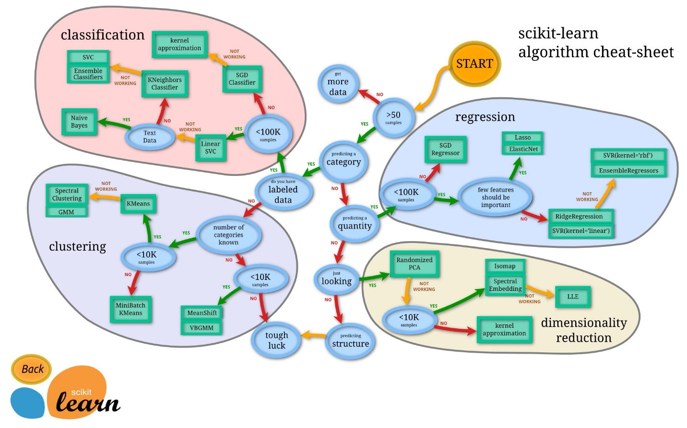

# General

### **损失函数**

> 一文读懂机器学习常用损失函数（Loss Function） [⭐](https://www.cnblogs.com/guoyaohua/p/9217206.html)
>
> 深度学习中常用的损失函数loss有哪些 [👉](https://mlog.club/article/13958)

回归：平方损失函数，绝对值损失函数

分类： logloss\(lr\); **交叉熵损失**; 0-1损失函数；HingeLoss\(SVM\)

#### **交叉熵损失函数**

透彻理解交叉熵背后的直觉

[https://blog.csdn.net/tsyccnh/article/details/79163834](https://blog.csdn.net/tsyccnh/article/details/79163834)

交叉熵、相对熵及KL散度通俗理解

[https://zhuanlan.zhihu.com/p/29321631](https://zhuanlan.zhihu.com/p/29321631)

通俗理解信息熵

[https://zhuanlan.zhihu.com/p/26486223](https://zhuanlan.zhihu.com/p/26486223)

**信息量**度量的是一个具体事件发生了所带来的信息，而**熵**则是在结果出来之前对可能产生的信息量的期望

熵\(用来表示所有信息量的期望, 信息量log\(p\(i\)\)

交叉熵

它可以克服方差代价函数更新权重过慢的问题。

可以看到，导数中没有σ′\(z\)这一项，\(不受激活函数的影响\)，权重的更新是受σ\(z\)−y这一项影响，即**受误差的影响**。所以当误差大的时候，权重更新就快，当误差小的时候，权重的更新就慢。这是一个很好的性质。

机器学习中常见的损失函数及其应用场景

[https://blog.csdn.net/zuolixiangfisher/article/details/88649110](https://blog.csdn.net/zuolixiangfisher/article/details/88649110)

### **激活函数**

激活函数应该具有哪些特征

[https://blog.csdn.net/u013887652/article/details/93037203](https://blog.csdn.net/u013887652/article/details/93037203)

容易求导；单调\(容易进行凸优化\)；处理简单\(计算方面\)；有界

 激活函数

[https://www.jiqizhixin.com/articles/2019-10-23](https://www.jiqizhixin.com/articles/2019-10-23)

### **梯度爆炸和消失**

预训练加微调

梯度剪枝（其思想是设置一个梯度剪切阈值，然后更新梯度的时候，如果梯度超过这个阈值，那么就将其强制限制在这个范围之内），权重正则

使用不同的激活函数 ：思想也很简单，如果激活函数的导数为1，那么就不存在梯度消失爆炸的问题了，每层的网络都可以得到相同的更新速度

Batch Norm：加速网络收敛速度，提升训练稳定性的效果

使用残差网络

使用LSTM

_From &lt;_[_https://blog.csdn.net/qq\_25737169/article/details/78847691_](https://blog.csdn.net/qq_25737169/article/details/78847691)_&gt;_

**Relu**

优点：解决梯度消失/爆炸问题；简单，计算速度快

缺点：负数部分恒为零，导致一些神经元无法激活（可以设置low lr解决）；不是中心对称

**Resnet和梯度弥散**

层叠过多的卷积层会出现一个问题，就是梯度弥散\(Vanishing\)，backprop无法把有效地把梯度更新到前面的网络层，导致前面的层参数无法更新。

模型的层数越深，这种梯度弥散的情况就更加严重，导致浅层部分的网络权重参数得不到很好的训练，这就是为什么在Resnet出现之前，CNN网络都不超过二十几层的原因。

### **过拟合问题**

数据增强

正则化

使用简单模型

Dropout，bagging\(用不同的模型拟合不同部分的训练集\)，boosting\(只使用简单的神经网络（层数、神经元数限制等）。通过训练一系列简单的神经网络，加权平均其输出\)

Early stopping

Bagging: 每个分类器都随机从原样本中做有放回的采样，然后分别在这些采样后的样本上训练分类器，然后再把这些分类器组合起来，简单的多数投票一般就可以

Boosting : 它通过迭代地训练一系列的分类器，每个分类器采用的样本分布都和上一轮的学习结果有关。

### **样本不均衡**

采样：上采样\(增多少样本的数据\)；下采样\(减少多样本的数据\)； 尝试人工产生数据

尝试别的评价指标： 谨慎选择AUC；可以观察观察不同算法在同一份数据下的训练结果的precision和recall；不要只看Accuracy；观察采取哪种评价指标更合适

尝试不同算法： 选择对数据倾斜相对不敏感的算法；集成学习；将任务转换成异常检测问题

loss加权重 :少数类乘上一个大于1的系数

如何解决数据不平衡问题

[https://www.cnblogs.com/charlotte77/p/10455900.html](https://www.cnblogs.com/charlotte77/p/10455900.html)

方差与偏差

什么是高/低方差、高/低偏差、\(推荐阅读\)

[https://blog.csdn.net/u010626937/article/details/74435109](https://blog.csdn.net/u010626937/article/details/74435109)

**偏差：准确率；方差：稳定性**

偏差和方差与过拟合欠拟合的关系

[https://blog.csdn.net/u012033832/article/details/78401486](https://blog.csdn.net/u012033832/article/details/78401486)

过拟合：增大数据规模、减小数据特征数（维数）、增大正则化系数λ

欠拟合：增多数据特征数、添加高次多项式特征、减小正则化系数λ

### **正则化**

机器学习之L1和L2正则化

[https://zhuanlan.zhihu.com/p/34883499](https://zhuanlan.zhihu.com/p/34883499)

通过降低复杂模型的复杂度来防止过拟合的规则称为正则化。

模型优化的目标 minimize\(Loss\(Data\|Model\)\) -&gt; minimize\(Loss\(Data\|Model\) + complexity\(Model\)\)

L1正则化，即原损失函数 + 所有权重的平均绝对值 \* λ ，其中λ &gt;0 （可以理解为每次从权重中减去一个常数）

L2正则化，即原损失函数 + 所有权重平方和的平均值 \* λ / 2 , λ&gt;0 （可以理解为每次移除权重的 x%）

（每次更新，ω都是往0靠，即使网络中的权重尽可能为0。\)

机器学习中正则化项L1和L2的直观理解

[https://blog.csdn.net/jinping\_shi/article/details/52433975](https://blog.csdn.net/jinping_shi/article/details/52433975)

L1正则化可以产生稀疏权值矩阵，即产生一个稀疏模型，可以用于特征选择

L2正则化可以防止模型过拟合（overfitting）；一定程度上，L1也可以防止过拟合

深入理解L1、L2正则化

[https://www.cnblogs.com/zingp/p/10375691.html](https://www.cnblogs.com/zingp/p/10375691.html)

l1 相比于 l2 为什么容易获得稀疏解？绝对值函数的尖峰

[https://www.zhihu.com/question/37096933](https://www.zhihu.com/question/37096933)

L1范数有棱角，和优化目标函数相切的点在各分量上要么有值要么为0

L2范数比较平滑，喜欢每个分量上都分一点

### **优化算法**

批梯度下降会获得全局最优解，缺点是在更新每个参数的时候需要遍历所有的数据，计算量会很大，并且会有很多的冗余计算，导致的结果是当数据量大的时候，每个参数的更新都会很慢。

随机梯度下降是以高方差频繁更新，优点是使得sgd会跳到新的和潜在更好的局部最优解，缺点是使得收敛到局部最优解的过程更加的复杂。

mini-batch梯度下降结合了sgd和batch gd的优点，每次更新的时候使用n个样本。减少了参数更新的次数，可以达到更加稳定收敛结果，一般在深度学习当中我们采用这种方法。

\(是不是就再调整learning rate\)

SGD -&gt; SGDM\(加入惯性\) -&gt; NAG\(看动量方向\) -&gt;AdaGrad\(加入二阶动量，保持住经常更新的参数\) -&gt; AdaDelta\(一段时间窗口的下降梯度\) -&gt; Adam -&gt; Nadam

SGD-M在SGD基础上增加了一阶动量，AdaGrad和AdaDelta在SGD基础上增加了二阶动量。把一阶动量和二阶动量都用起来，就是Adam了——Adaptive + Momentum

_From &lt;_[_https://zhuanlan.zhihu.com/p/32230623_](https://zhuanlan.zhihu.com/p/32230623)_&gt; \(Nice\)_

深度学习一般不用二阶优化，成本太高

优化算法的思路

第一个是如何对模型选择合适的学习率。自始至终保持同样的学习率其实不太合适。因为一开始参数刚刚开始学习的时候，此时的参数和最优解隔的比较远，需要保持一个较大的学习率尽快逼近最优解。但是学习到后面的时候，参数和最优解已经隔的比较近了，你还保持最初的学习率，容易越过最优点，在最优点附近来回振荡，通俗一点说，就很容易学过头了，跑偏了。

第二个是如何对参数选择合适的学习率。在实践中，对每个参数都保持的同样的学习率也是很不合理的。有些参数更新频繁，那么学习率可以适当小一点。有些参数更新缓慢，那么学习率就应该大一点。

牛顿法和梯度下降

牛顿下降法和梯度下降法基础

[https://www.jianshu.com/p/e976e1853cb9](https://www.jianshu.com/p/e976e1853cb9)

牛顿法是二阶收敛，梯度下降是一阶收敛，所以牛顿法就更快 from [zhihu](https://www.zhihu.com/question/19723347/answer/28414541)

牛顿下降法利用了函数的更多的信息，能够更好的拟合局部曲面，所以收敛的速度也会加快。

### **BatchNorm**

BatchNorm就是在深度神经网络训练过程中使得每一层神经网络的输入保持相同分布的。

 深入理解Batch Normalization批标准化

[https://www.cnblogs.com/guoyaohua/p/8724433.html](https://www.cnblogs.com/guoyaohua/p/8724433.html)

基本思想：

把逐渐向非线性函数映射后向取值区间极限饱和区靠拢的输入分布强制拉回到均值为0方差为1的比较标准的正态分布，使得非线性变换函数的输入值落入对输入比较敏感的区域，以此避免梯度消失问题。梯度变大意味着学习收敛速度快，能大大加快训练速度。

作用：

①不仅仅极大提升了训练**速度**，收敛过程大大加快；

②还能增加分类**效果**，一种解释是这是类似于Dropout的一种防止过拟合的正则化表达方式，所以不用Dropout也能达到相当的效果；

③另外调参过程也简单多了，对于**初始化**要求没那么高，而且可以使用大的**学习率**等。

方式：

对每个隐层神经元的激活值做BN，可以想象成每个隐层又加上了一层BN操作层，它位于X=WU+B激活值获得之后，非线性函数变换之前。

机器学习领域有个很重要的假设：IID独立同分布假设，就是假设训练数据和测试数据是满足相同分布的，这是通过训练数据获得的模型能够在测试集获得好的效果的一个基本保障。那BatchNorm的作用是什么呢？BatchNorm就是在深度神经网络训练过程中使得每一层神经网络的输入保持相同分布的。

ReLU函数进行Batch Normalization意义分析

[https://blog.csdn.net/williamyi96/article/details/77544638](https://blog.csdn.net/williamyi96/article/details/77544638)

如果输入的数据是不同分布的，那么相当于我们的神经网络还要针对这种不同分布去提升网络参数的适应性，从而使得网络变得难以训练。实践表明，将输入数据规范化为正态分布确实有利于提升网络的整体效果。

机器学习面试题之——BatchNorm

[https://blog.csdn.net/cuiy0818/article/details/81261407](https://blog.csdn.net/cuiy0818/article/details/81261407)

### **欧氏距离和余弦相似度**

[https://blog.csdn.net/linvo/article/details/9333019](https://blog.csdn.net/linvo/article/details/9333019)

余弦距离、欧氏距离和杰卡德相似性度量的对比分析

[https://www.cnblogs.com/chaosimple/p/3160839.html](https://www.cnblogs.com/chaosimple/p/3160839.html)

相比欧氏距离，余弦距离更加注重两个向量在方向上的差异

**欧氏距离**能够体现个体**数值特征的绝对差异**，所以更多的用于需要从维度的数值大小中体现差异的分析，如使用用户行为指标分析用户价值的相似度或差异。

**余弦距离**更多的是从**方向上区分差异**，而对绝对的数值不敏感，更多的用于使用用户对内容评分来区分兴趣的相似度和差异，同时修正了用户间可能存在的度量标准不统一的问题（因为余弦距离对绝对数值不敏感）

### **机器学习算法的应用场景**

[https://www.zhihu.com/question/26726794](https://www.zhihu.com/question/26726794)

数据维度越高，随机森林就比AdaBoost强越多，但是整体不及SVM\[2\]。

数据量越大，神经网络就越强。

**KNN**: 可解释性非常强，可做推荐算法

**决策树**：可解释性强，理解数据，容易新样本被攻击，容易过拟合

**RF**: 随机森林在现实分析中被大量使用，它相对于决策树，在准确性上有了很大的提升，同时一定程度上改善了决策树容易被攻击的特点。

数据维度相对低（几十维），同时对准确性有较高要求时。

因为不需要很多参数调整就可以达到不错的效果，基本上不知道用什么方法的时候都可以先试一下随机森林。

**SVM**: 在很多数据集上都有优秀的表现。

相对来说，SVM尽量保持与样本间距离的性质导致它抗攻击的能力更强。

和随机森林一样，这也是一个拿到数据就可以先尝试一下的算法。

**LR:** 输出值自然地落在0到1之间，并且有概率意义,效果一般，却胜在模型清晰,可以帮助理解数据。

**Boosting**:自带了特征选择,只使用在训练集中发现有效的特征\(feature\),这样就降低了分类时需要计算的特征数量，也在一定程度上解决了高维数据难以理解的问题。

**Bagging:** 可以一定程度上避免过拟合\(overfit\)

[https://www.zhihu.com/question/26726794/answer/544818558](https://www.zhihu.com/question/26726794/answer/544818558)

问题中涉及的几个算法都是数据分类的基本技术，其实当样本数据质量很好的时候，各个算法结果之间的差异不会特别大。这个时候可以**根据样本的分布特点**和具体**要解决的业务问题**等信息，选择一个或者几个相适合的算法，再进一步根据模型训练结果、验证结果选择一个结果相对较好的算法。

当然，样本数据质量很差的时候，任何算法都无法得到很好的结果，所以这次先不考虑样本数据的获取和质量问题，但从算法角度来考虑，各个算法都有自己的特点。

**朴素贝叶斯**算法假定所有输入属性的重要性是相等的，且彼此是独立的，这个前提满足的情况下，贝叶斯算法往往十分精确，但实际情况是，经常发生不满足条件独立性的情况，并且缺少可用的概率数据。

决策树算法相对比较好理解，也不需要对样本数据做任何假设，相对更适合处理非数值型数据，但决策数算法的结果有时会很复杂，同一个变量在树生长的时候反复用了好几次导致不好解释，尤其当样本数据是数值型时，数据的微小变化都会影响每个节点变量以及阈值的选择，结果较不稳定。

K 近邻算法是基于类比的学习，可以对缺失值进行处理，但维度过高时，也容易过拟合，本身不建立X与Y的量化公式，算法费时较长。

SVM算法使用一种非线性映射，所以对于非线性决策边界的识别能力是比较强的，本身不容易过拟合，但由于算法本身效果依赖核心点的选择，所以扩展到大数据集时相对比较费时。

LR本身有明确的概率公式，由于会对连续变量进行分箱处理，所以会降低过拟合的程度，增强模型泛化能力。但是对于多分类、或者非线性的决策边界时，表现效果有限。

选择算法时，除了考虑算法本身的特点，还应考虑具体的业务需求，比如有时候业务需求注重解释性。并且以打分卡的形式展现每个属性和个体，那个即使其他算法会更准确一些，考虑到应用，也会选择逻辑回归算法。

所以，具体情况还需具体分析，没有一成不变的准则，最终目的都是为**了更好的解决业务问题。**

