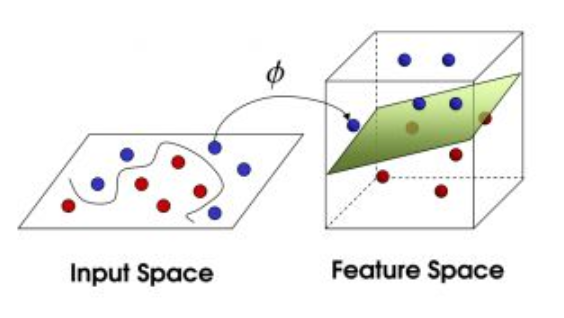
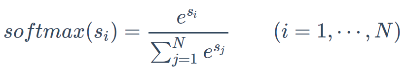

# Untitled

个人感觉高频话题是 SVM、LR、决策树（决策森林）和聚类算法，要重点准备；

算法要从以下几个方面来掌握 产生背景，适用场合（数据规模，特征维度，是否有 Online 算法，离散/连续特征处理等角度）；原理推导（最大间隔，软间隔，对偶）；求解方法（随机梯度下降、拟牛顿法等优化算法）；优缺点，相关改进；和其他基本方法的对比；

机器学习经典算法优缺点总结

[https://zhuanlan.zhihu.com/p/27160995](https://zhuanlan.zhihu.com/p/27160995)

机器学习常见算法个人总结（面试用）

[http://kubicode.me/2015/08/16/Machine%20Learning/Algorithm-Summary-for-Interview/](http://kubicode.me/2015/08/16/Machine%20Learning/Algorithm-Summary-for-Interview/)

#### **LR**

 逻辑回归的常见面试点总结

[https://www.cnblogs.com/ModifyRong/p/7739955.html](https://www.cnblogs.com/ModifyRong/p/7739955.html)

逻辑回归假设数据服从伯努利分布,通过极大化似然函数的方法，运用梯度下降来求解参数，来达到将数据二分类的目的。

这里面其实包含了5个点 1：逻辑回归的假设，2：逻辑回归的损失函数，3：逻辑回归的求解方法，4：逻辑回归的目的，5:逻辑回归如何分类。

逻辑回归假设样本为正的概率是

损失函数是它的极大似然函数

Loglogss

优点是形式简单，模型的可解释性非常好; 模型效果不错\(作为baseline\); 训练速度较快; 资源占用小

缺点准确率并不是很高; 很难处理数据不平衡的问题; 只做二分类; 逻辑回归本身无法筛选特征。有时候我们会用gbdt来筛选特征，然后再上lr。

 逻辑回归之问题建模分析\(极大似然推导\)

[https://www.cnblogs.com/90zeng/p/logistic\_regression\_model.html](https://www.cnblogs.com/90zeng/p/logistic_regression_model.html)

梯度更新

sigmoid求导

[https://blog.csdn.net/caimouse/article/details/66473030](https://blog.csdn.net/caimouse/article/details/66473030)s

LR参数详解

[https://cloud.tencent.com/developer/article/1146080](https://cloud.tencent.com/developer/article/1146080)

史上最直白的logistic regression 之 一

[https://blog.csdn.net/lizhe\_dashuju/article/details/49864569](https://blog.csdn.net/lizhe_dashuju/article/details/49864569)

Logistic Regression 的前世今生（理论篇）

[https://www.cnblogs.com/mfmdaoyou/p/7392352.html](https://www.cnblogs.com/mfmdaoyou/p/7392352.html)

浅谈LR算法的Cost Function

[https://www.cnblogs.com/maybe2030/p/9163479.html](https://www.cnblogs.com/maybe2030/p/9163479.html)

LR采用了最小化交叉熵或者最大化似然估计函数来作为Cost Function

Logistic Regression常见面试题整理

[https://zhuanlan.zhihu.com/p/34670728](https://zhuanlan.zhihu.com/p/34670728)

#### **SVM**

支持向量机是1995年首先提出的，它在**解决小样本、非线性及高维**模式识别中表现出许多特有的优势，并能够推广应用到函数拟合等其他机器学习问题中。

通俗来讲，它是一种二分类模型。其基本模型定义为特征空间上的间隔最大的线性分类器，其学习策略便是间隔最大化，最终可转化为一个凸二次规划问题的求解。

\[SVM系列之一\]白话支持向量机（SVM） [二](https://blog.csdn.net/zhang_can/article/details/79439384) [三](https://blog.csdn.net/zhang_can/article/details/79478032)

[https://blog.csdn.net/zhang\_can/article/details/79405545](https://blog.csdn.net/zhang_can/article/details/79405545)

支持向量机（SVM）可以白话为：试图找到一个木棍放置的最佳位置，使得木棍的两边有尽可能大的间隙。

我们可以定义几个高大上的名词，把这些小球叫做数据（data），把棍子叫做分类器（classifier），最大间隙trick叫做优化（optimization）， 拍桌子叫做核化（kernelling）, 那张纸叫做超平面（hyperplane）。

支持向量机入门系列-1：引子 🌟 [二](https://blog.csdn.net/vivihe0/article/details/7037945) [三](https://blog.csdn.net/vivihe0/article/details/7046454) [四](https://blog.csdn.net/vivihe0/article/details/7062383)

[https://blog.csdn.net/vivihe0/article/details/7019826](https://blog.csdn.net/vivihe0/article/details/7019826)

超平面：超平面就是平面中的直线在高维空间中的推广。那么，对于三维空间，超平面就是平面了。对于更高维的空间，我们只能用公式来表达，而缺少直观的图形了。总之，在n维空间中的超平面是n-1维的。

超平面的公式为

公式中的w为可以调整的系数向量，b为bias。注意我们的表达习惯，所有的向量都是列向量，所以在第一项的内积中向量w需要进行转置。

五个部分：基础知识之拉格朗日乘数法、svm要解决的问题、完全线性可分中的svm、软间隔svm、线性不可分与核函数。

支持向量机（SVM）入门理解与推导

[https://blog.csdn.net/sinat\_20177327/article/details/79729551](https://blog.csdn.net/sinat_20177327/article/details/79729551)

深入理解拉格朗日乘子法（Lagrange Multiplier\) 和KKT条件

[https://blog.csdn.net/xianlingmao/article/details/7919597](https://blog.csdn.net/xianlingmao/article/details/7919597)

SVM参数说明

[https://blog.csdn.net/szlcw1/article/details/52336824](https://blog.csdn.net/szlcw1/article/details/52336824)

#### **Softmax**

 理解softmax分类器

[https://scientificrat.com/2018/06/21/%E7%90%86%E8%A7%A3softmax%E5%88%86%E7%B1%BB%E5%99%A8/](https://scientificrat.com/2018/06/21/%E7%90%86%E8%A7%A3softmax%E5%88%86%E7%B1%BB%E5%99%A8/)

softmax就是一个能将\(−∞,+∞\)\(−∞,+∞\)的一组评分转化为一组概率，并让它们的和为1的归一化的函数（squashing function），而且这个函数是保序的，原来大的评分转换后的概率大，而小的评分对应的概率小。

logistic函数和softmax函数

[https://www.cnblogs.com/maybe2030/p/5678387.html](https://www.cnblogs.com/maybe2030/p/5678387.html)

#### **评价指标**

 准确率\(Accuracy\), 精确率\(Precision\), 召回率\(Recall\)和F1-Measure

[https://blog.argcv.com/articles/1036.c](https://blog.argcv.com/articles/1036.c)

准确率\(accuracy\), 其定义是: 对于给定的测试数据集，分类器正确分类的样本数与总样本数之比

精确率\(precision\)的公式是P=TP/\(TP+FP\),它计算的是所有"正确被检索的item\(TP\)"占所有"实际被检索到的\(TP+FP\)"的比例，查准率

召回率\(recall\)的公式是R=TP/\(TP+FN\),它计算的是所有"正确被检索的item\(TP\)"占所有"应该检索到的item\(TP+FN\)"的比例，查全率

F1值就是精确值和召回率的调和均值

![&#x65E0; &#x5173; \(NonReLevant\), &#x8D1F; &#x7C7B; 
&#x88AB; &#x68C0; &#x7D22; &#x5230; 
\(Retrieved &#x3015; 
&#x7C7B; &#x4E25; &#x53BB; &#x771F; &#x4F8B; &#x5B50; &#x4E2D; &#x5C31; &#x662F; &#xFF0C; &#x5206; &#x660E; &#x662F; &#x5973; &#x751F; &#x8FD9; &#x54E5; &#x662F; &#x4E00; &#x4E2A; &#x7537; &#x751F; &#x88AB; &#x5224; &#x65AD; &#x4E3A; &#x7537; &#x751F; &#x50CF; &#x6211; &#x8FD9; &#x6837; &#x7684; &#x7EAF; &#x7237; 
&#x76F8; &#x5173; \(Relevant\), &#x6B63; &#x7C7B; 
true POSIttvesCTP iE &#x7C7B; &#x5224; &#x5B9A; &#x4E3A; &#x6B63; &#x7C7B; &#xFF0C; &#x4F8B; 
&#x5B50; &#x4E2D; &#x5C31; &#x662F; &#x6B63; &#x786E; &#x7684; &#x5224; &#x5B9A; &#x5230; &#x8FD9; &#x4F4D; &#x662F; &#x5973; &#x751F; &#x52F9; 
&#x672A; &#x88AB; &#x68C0; &#x7D22; &#x5230; &#xFF08; N &#x8308; false negatives\(\)N &#x6B63; &#x7C7B; &#x5224; &#x5B9A; &#x4E3A; &#x8D1F; 
false positives &#x3014; FP &#x8D1F; &#x7C7B; &#x5224; &#x5B9A; &#x4E3A; ik &#x7C7B; &#xFF0C; &quot; &#x5B58; 
&#x4F2A; &#x5230; &#xFF0C; &#x4F8B; &#x4E86; &#x4E2D; &#x5C31; &#x662F; &#x5206; &#x660E; &#x662F; &#x7537; &#x751F; &#x5374; &#x5224; &#x65AD; &#x4E3A; &#x5973; &#x751F; &#xFF0C; 
&#x5F53; &#x4E0B; &#x4F2A; &#x5982; &#x6A2A; &#x884C; &#x8FD9; &#x4E2A; &#x61F5; &#x5E38; &#x6709; &#x4EBA; &#x72AF; &#x3015; 
true negatives\(\)N &#x8D1F; &#x7C7B; &#x5224; &#x5B9A; &#x4E3A; &#x8D1F; &#x7C7B; &#xFF0C; &#x4E5F; &#x5C31; 
Retrieved\) 
&#x4EEC; &#x5374; &#x5224; &#x65AD; &#x4E3A; &#x7537; &#x751F; &#x4E00; &#x4E00; &#x6881; &#x5C71; &#x4F2F; &#x540C; &#x5B66; &#x72AF; &#x7684; &#x9519; &#x5C31; &#x662F; &#x4EEC; &#x4E00; &#x51C6; &#x4E3F; L &#x5C31; &#x4F1A; &#x5728; &#x6B64; &#x5904; &#x3015; ](../.gitbook/assets/15.png)

如何理解机器学习和统计中的AUC？

[https://www.zhihu.com/question/39840928](https://www.zhihu.com/question/39840928)

**ROC曲线**

X轴假正类率\(False Postive Rate\)FPR: FP/\(FP+TN\)，代表分类器预测的正类中实际负实例占所有负实例的比例。1-Specificity

Y轴真正类率\(True Postive Rate\)TPR: TP/\(TP+FN\),代表分类器预测的正类中实际正实例占所有正实例的比例。Sensitivity

机器学习算法常用指标总结

[https://www.cnblogs.com/maybe2030/p/5375175.html](https://www.cnblogs.com/maybe2030/p/5375175.html)

**AUC**：假设分类器的输出是样本属于正类的socre，则AUC的物理意义为，任取一对\(正、负\)样本，正样本的score大于负样本的score的概率。

AUC值为ROC曲线所覆盖的区域面积,显然,AUC越大,分类器分类效果越好。AUC = 1，是完美分类器。

**回归模型的评价指标**

[https://blog.csdn.net/chao2016/article/details/84960257](https://blog.csdn.net/chao2016/article/details/84960257)

MSE - RMSE - MAE - R-squared

#### **RF、GBDT、XGBoost**面试级整理

[https://blog.csdn.net/qq\_28031525/article/details/70207918](https://blog.csdn.net/qq_28031525/article/details/70207918)

都属于集成学习（Ensemble Learning），集成学习的目的是通过结合多个基学习器的预测结果来改善单个学习器的泛化能力和鲁棒性。

根据个体学习器的生成方式，目前的集成学习方法大致分为两大类：即个体学习器之间存在强依赖关系、必须串行生成的序列化方法，以及个体学习器间不存在强依赖关系、可同时生成的并行化方法；前者的代表就是Boosting，后者的代表是Bagging和“随机森林”（Random Forest）。

[RF参数](https://www.cnblogs.com/pinard/p/6160412.html); [GBDT参数](https://www.cnblogs.com/pinard/p/6143927.html)

GBDT问题+方差/偏差

[https://zhuanlan.zhihu.com/p/65597945](https://zhuanlan.zhihu.com/p/65597945)

RF是通过减少模型的方差来提高性能，而GBDT是减少模型的偏差来提高性能的原理

GBDT和XGBoost区别

1.GBDT在优化的时候只用到一阶导数信息，XGBoost则对代价函数进行了二阶泰勒展开，得到一阶和二阶导数, 不仅有速度信息\(一阶\)，还有加速度信息\(二阶\)

2. XGBoost在代价函数中加入了正则项，xgboost与gbdt比较大的不同就是目标函数的定义: l\(xgboost\) = loss\(mse/logloss\) + 正则，加入了正则用于控制模型的复杂度

3. XGBoost在特征粒度上并行等

**随机森林**

[https://www.cnblogs.com/maybe2030/p/4585705.html](https://www.cnblogs.com/maybe2030/p/4585705.html)

如果训练集大小为N，对于每棵树而言，随机且有放回地从训练集中的抽取N个训练样本（这种采样方式称为bootstrap sample），作为该树的训练集。

\[机器学习\]信息&熵&信息增益

[https://www.cnblogs.com/fantasy01/p/4581803.html?utm\_source=tuicool](https://www.cnblogs.com/fantasy01/p/4581803.html?utm_source=tuicool)

决策树与迭代决策树（GBDT）

[https://www.cnblogs.com/maybe2030/p/4734645.html](https://www.cnblogs.com/maybe2030/p/4734645.html)

**GBDT**

gbdt 是通过采用加法模型（即基函数的线性组合），以及不断减小训练过程产生的残差来达到将数据分类或者回归的算法。

gbdt通过多轮迭代,每轮迭代产生一个弱分类器，每个**Loss**: 对于分类模型，有对数似然损失函数"deviance"和指数损失函数"exponential"两者输入选择。默认是对数似然损失函数"deviance"。在原理篇中对这些分类损失函数有详细的介绍。一般来说，推荐使用默认的"deviance"。它对二元分离和多元分类各自都有比较好的优化。

**优点**：预测精度高; 适合低维数据; 能处理非线性数据; 可以灵活处理各种类型的数据，包括连续值和离散值; 使用一些健壮的损失函数，对异常值的鲁棒性非常强。比如 Huber损失函数和Quantile损失函数。

**缺点**: 由于弱学习器之间存在依赖

分类器在上一轮分类器的**残差**基础上进行训练。对弱分类器的要求一般是足够简单，并且是**低方差和高偏差**的。因为训练的过程是通过降低偏差来不断提高最终分类器的精度。

 机器学习算法GBDT的面试要点总结-上篇

[https://www.cnblogs.com/ModifyRong/p/7744987.html](https://www.cnblogs.com/ModifyRong/p/7744987.html)

gbdt 的算法的流程，gbdt如何选择特征，如何产生特征的组合，以及gbdt 如何用于分类?

CART TREE\(是一种二叉树\) 生成的过程其实就是一个选择特征的过程

关系，难以并行训练数据。不过可以通过自采样的SGBT来达到部分并行。如果数据维度较高时会加大算法的计算复杂度

GBDT算法的特征重要度计算

[https://blog.csdn.net/yangxudong/article/details/53899260](https://blog.csdn.net/yangxudong/article/details/53899260)

常见的2类**无监督**算法是：聚类、降维

常见的**最优化**的手段：梯度上升（下降）法；牛顿法 / 拟牛顿法；坐标下降法

最优化的问题：线性规划；二次规划；二次约束的二次规划；半正定规划

判断函数是否**凸函数**的充要条件满足以下其一：

* 1. 对于函数在定义域的任意取值，函数的值都大于或者等于对函数在这点的一阶近似。

* 1. 二阶导数大于等于零

**线性分类器**

线性linear，指量与量之间按比例、成直线的关系，在数学上可以理解为一阶导数为常数的函数；

非线性non-linear则指不按比例、不成直线的关系，一阶导数不为常数。

线性分类器：模型是参数的线性函数，分类平面是（超）平面；如：感知机，LDA，逻辑斯特回归，SVM（线性核）

非线性分类器：模型分界面可以是曲面或者超平面的组合。如：朴素贝叶斯，kNN，决策树，RF、GBDT、多层感知机、SVM（非线性核）

#### **K-MEANS**

5 分钟带你弄懂 k-means 聚类

[https://blog.csdn.net/huangfei711/article/details/78480078](https://blog.csdn.net/huangfei711/article/details/78480078)

k-means 聚类

基于向量距离来做聚类，**采用距离作为相似性的评价指标**，即认为两个对象的距离越近，其相似度就越大

最大的特点是简单，好理解，运算速度快，但是只能应用于连续型的数据，并且一定要在聚类前需要手工指定要分成几类。

**Workflow**

首先输入 k 的值，即我们指定希望通过聚类得到 k 个分组；

从数据集中**随机选取 k 个数据点**作为初始大佬（质心）；

对集合中每一个小弟，计算与每一个大佬的距离，离哪个大佬距离近，就跟定哪个大佬，**归类**。

这时每一个大佬手下都聚集了一票小弟，这时候召开选举大会，每一群选出**新的质心**（即通过算法选出新的质心）。

如果新大佬和老大佬之间的距离小于某一个设置的阈值（表示重新计算的质心的位置变化不大，趋于稳定，或者说收敛），可以认为我们进行的聚类已经达到期望的结果，算法终止。

如果新大佬和老大佬距离变化很大，需要**迭代**3~5步骤，**直到新旧质点距离小于特定阈值**。

#### **KNN 分类算法**

一文搞懂k-NN算法

[https://zhuanlan.zhihu.com/p/25994179](https://zhuanlan.zhihu.com/p/25994179)

样本的类别由他周围的K个样本投票决定

K值的选取：我们一般选取一个较小的数值，通常采取 交叉验证法来选取最优的k值。选取k值很重要的关键是实验调参

**KNN和K-mean有什么不同？**

[https://zhuanlan.zhihu.com/p/31580379](https://zhuanlan.zhihu.com/p/31580379)

监督/无监督；分类/聚类

 在KNN或K-means中，我们是用欧氏距离来计算最近的邻居之间的距离，为什么不用曼哈顿距离？

曼哈顿距离只计算水平和垂直距离，所以有维度的限制。欧氏距离可以用于任何空间距离的计算问题。

**降维算法**

降维的本质是学习一个映射函数 f : x-&gt;y，其中x是原始数据点的表达，目前最多使用向量表达形式。 y是数据点映射后的低维向量表达。f可能是显式的或隐式的、线性的或非线性的。

 数据降维方法总结

[https://www.cnblogs.com/guoyaohua/p/8855636.html](https://www.cnblogs.com/guoyaohua/p/8855636.html)

**PCA**

Principal components analysis\(PCA\):主元分析

[https://www.cnblogs.com/90zeng/p/PCA.html](https://www.cnblogs.com/90zeng/p/PCA.html)

最常用的线性降维方法，它的目标是通过某种线性投影，将高维的数据映射到低维的空间中表示，并期望在所投影的维度上数据的方差最大，以此使用较少的数据维度，同时保留住较多的原数据点的特性。

机器学习基础（2）- PCA与LDA比较

[https://www.jianshu.com/p/982c8f6760de](https://www.jianshu.com/p/982c8f6760de)

**LDA**

Linear Discriminant Analysis是一种有监督的线性降维算法。与PCA保持数据信息不同，LDA是为了使得降维后的数据点尽可能地容易被区分

既然是线性的，那么就是希望找到映射向量a， 使得 a‘X后的数据点能够保持以下两种性质：

1. 同类的数据点尽可能的接近（within class）

2. 不同类的数据点尽可能的分开（between class）

**对偶问题**

为什么我们要考虑线性规划的对偶问题？

[https://www.zhihu.com/question/26658861/answer/53394624](https://www.zhihu.com/question/26658861/answer/53394624)

对偶问题就被用来辅助解决原问题甚至通过解对偶问题来解原问题。

如何通俗地讲解对偶问题？

[https://www.zhihu.com/question/58584814/answer/693584680](https://www.zhihu.com/question/58584814/answer/693584680)

 简易解说拉格朗日对偶（Lagrange duality）

[https://www.cnblogs.com/90zeng/p/Lagrange\_duality.html](https://www.cnblogs.com/90zeng/p/Lagrange_duality.html)

**核函数**

核函数只是用来计算映射到高维空间之后的内积的一种简便方法。

核函数将样本通过一个映射函数把它从原始空间投射到一个更高维的特征空间，使得样本在这特征空间线性可分

贝叶斯理论思想

[https://blog.csdn.net/u013904605/article/details/38663745](https://blog.csdn.net/u013904605/article/details/38663745)

通俗易懂！白话朴素贝叶斯

[https://juejin.im/post/5b3ecf186fb9a04fd93e1122\#heading-3](https://juejin.im/post/5b3ecf186fb9a04fd93e1122#heading-3)

